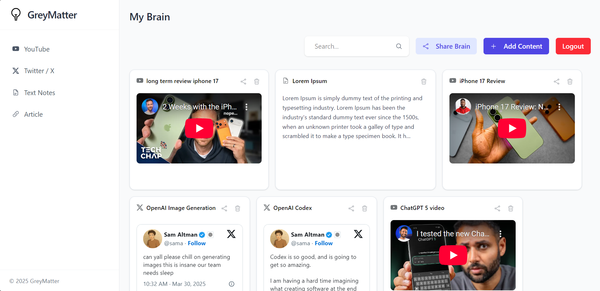
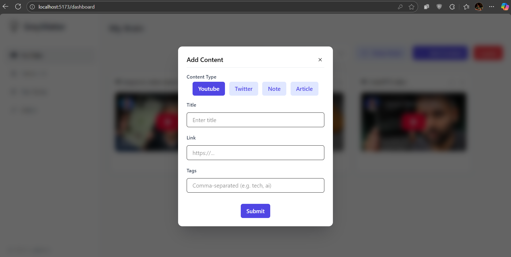

# GreyMatter – Your Second Brain

A full-stack **personal knowledge and content management app** built with a **React (TypeScript)** frontend, **Express (TypeScript)** backend, **MongoDB** database, and a **Python RAG (Retrieval-Augmented Generation) service** powered by **Pinecone** vector database and **Gemini** for LLM inferencing.

---

## Overview

**GreyMatter** helps you capture, organize, and query your thoughts and inspirations from multiple sources — notes, blogs, videos, and tweets — all in one place.
It acts as your digital “second brain”, enabling both structured organization and intelligent semantic search across your content.

---

## Tech Stack

| Layer              | Technology                      |
| :----------------- | :------------------------------ |
| Frontend           | React (TypeScript), TailwindCSS |
| Backend            | Express (TypeScript), MongoDB   |
| AI Service         | Python (FastAPI)                |
| Vector Database    | Pinecone                        |
| LLM                | Google Gemini                   |
| Content Extraction | Firecrawl                       |

---

## Key Features

### User Accounts

* Secure **Signup** and **Signin** support for user authentication.
* Each user has their own private workspace and content.

### Notes Dashboard

* Centralized dashboard for all saved content.
* **Add Notes** of multiple types:

  * **Text notes**
  * **Blog/article links** (content auto-extracted via Firecrawl)
  * **YouTube videos**
  * **Tweets**
* **Delete Notes** directly from the dashboard.
* Filter and organize content efficiently.

### 🔗 Share Your Brain

* Generate a **shareable link** to allow others to explore your curated “second brain”.

### Intelligent Search (RAG-powered)

* Ask **natural language questions** to search across your notes.
* The **Python RAG service** handles:

  * **Chunking and embedding creation**
  * **Semantic retrieval using Pinecone**
  * **Contextual answer generation with Gemini**
* Designed for meaningful question-answering rather than simple keyword lookup.

---

## Architecture Overview

```
React (Frontend)
   ↓
Express API (Backend)
   ↓
Python RAG Service → Pinecone (Vector DB)
                 ↘ Gemini (LLM)
                 ↘ Firecrawl (Content Extraction)
```

---

## Current Limitations

* The current search is **semantic only** (not keyword based) — it generates answers instead of showing direct note matches.
* **Tweets** are not processed for embeddings or chunking due to unavailable free APIs for scraping tweet content.

---

## Screenshots

### Signup Page


### Dashboard



### Filter-enabled Dashboard


### Create Content



### Search Query Results


### Shared Link


